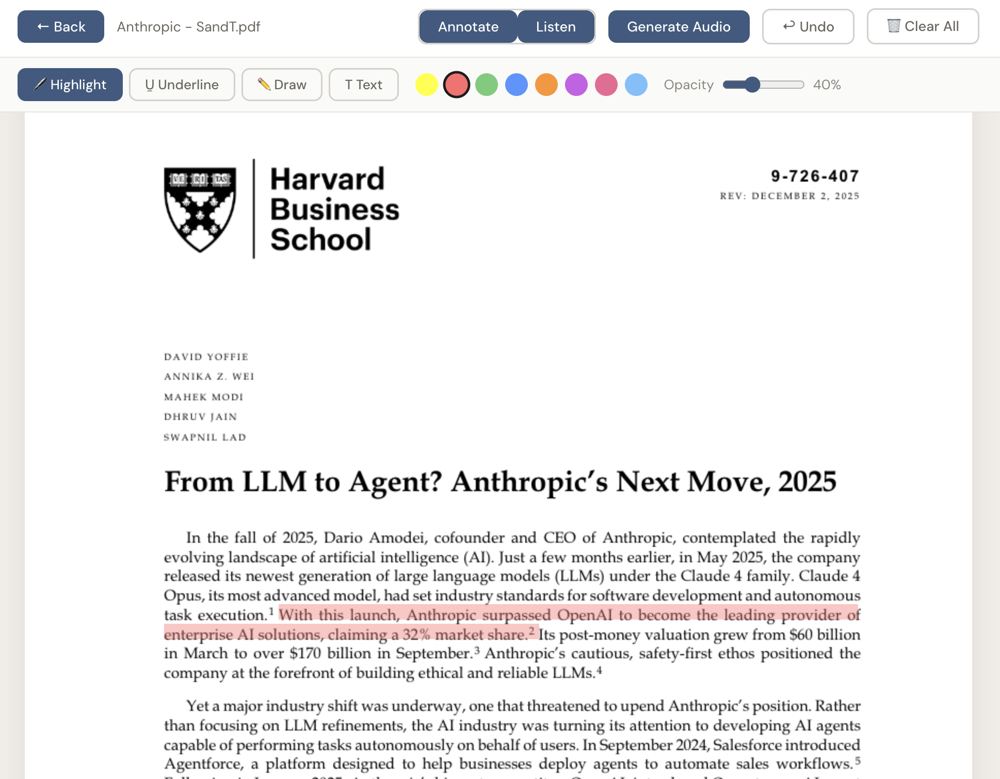

# HBS Case Reader

A reading tool for MBA case prep. Upload a PDF, generate audio via the ElevenLabs API, and annotate while you listen in one place.



---

## Why I built this

My case prep workflow had a frustrating gap. I would download a case from Canvas, upload it to Speechify for audio, and open it separately in Lumen for annotation. I was constantly switching between two windows to pause or replay the audio with no way to sync up what I was hearing with what I was annotating. I wanted a single tool where the PDF, the audio, and my annotations live together. I also wanted a concrete reason to work directly with the ElevenLabs API.

---

## What it does

Upload any PDF and the app renders it page by page. From there you can generate text-to-speech audio of the case content using ElevenLabs, then read and listen at the same time.

The annotation layer sits directly on the PDF using a text-selection model, so highlighting lands precisely on the words you select rather than as a freehand overlay. You can pick from eight colors, adjust opacity, double-highlight to darken, and undo the last annotation or clear everything.

The audio player includes playback speed controls from 1x to 2x and 10-second skip buttons in both directions.

---

## Product decisions worth noting

**Text-layer highlighting over freehand drawing.** The first version rendered PDF pages as static images. Annotation required a separate canvas layer drawn over the image, which meant highlights were approximate brush strokes rather than word-accurate marks. I rebuilt the rendering to use PDF.js text extraction, placing invisible selectable spans over each rendered page so highlights apply directly to the words you select. The tradeoff was implementation time upfront and losing some flexibility for non-text PDFs, but the reading experience is meaningfully closer to studying a real document.

**Audio chunking architecture.** The ElevenLabs Starter plan has a per-request character limit. The app currently generates audio for the first 15,000 characters of a case, roughly 10-12 minutes. The chunking logic to stitch multiple API responses into a single audio file is built and tested. It is gated by credits, not missing from the codebase. The tradeoff is that longer cases get cut off, which is friction I've hit personally.

**Opacity accumulation on double-highlight.** Highlighting the same text twice increases opacity rather than resetting it, which mirrors how physical highlighters work and lets you add emphasis without switching tools. The tradeoff is that it's not immediately obvious behavior so a first-time user might expect a second highlight to toggle off rather than darken, but the natural feel felt worth a small learning curve.

---

## What's next

- Reading position indicator that shows which sentence the audio is currently reading
- Persistent annotation storage using Firebase so highlights survive across sessions
- Full-case audio generation once credit limits allow
- Drawing layer for freehand margin notes

---

## How to run it

Clone the repo and install dependencies:
```bash
git clone https://github.com/princessadentan/hbs-case-reader.git
cd hbs-case-reader
npm install
```

Create a `.env` file in the root with your API keys:
```
REACT_APP_ELEVENLABS_API_KEY=your_elevenlabs_key_here
REACT_APP_FIREBASE_API_KEY=your_firebase_api_key
REACT_APP_FIREBASE_AUTH_DOMAIN=your_project.firebaseapp.com
REACT_APP_FIREBASE_PROJECT_ID=your_project_id
REACT_APP_FIREBASE_STORAGE_BUCKET=your_project.firebasestorage.app
REACT_APP_FIREBASE_MESSAGING_SENDER_ID=your_sender_id
REACT_APP_FIREBASE_APP_ID=your_app_id
```

Start the development server:
```bash
npm start
```

---

## Built with

- React
- PDF.js for PDF rendering and text extraction
- ElevenLabs API for text-to-speech
- Firebase for backend and authentication
- Native Canvas API for the annotation layer

---

*HBS '26. Previously Google Search and Google X. Focused on AI, emerging markets, and the infrastructure that makes intelligence useful.*
